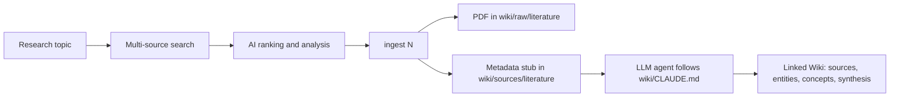

<h1 align="center">
  
  
  
  
</h1>

<h1 align="center">Search Papers</h1>

<p align="center">
  <b>AI-powered academic paper search assistant</b><br>
  From paper search to linked research knowledge base<br>
  Cross-platform literature retrieval, DeepSeek AI analysis, and an integrated <b>LLM Wiki</b><br>
  Supports <b>any university</b> — works worldwide
</p>

<p align="center">
  <a href="#-features">Features</a> •
  <a href="#-at-a-glance">At a Glance</a> •
  <a href="#-quick-start">Quick Start</a> •
  <a href="#-usage">Usage</a> •
  <a href="#-llm-wiki-integration">LLM Wiki</a> •
  <a href="#-configuration">Configuration</a> •
  <a href="#-architecture">Architecture</a> •
  <a href="#-command-reference">Commands</a> •
  <a href="#-faq">FAQ</a> •
  <a href="README_CN.md">中文文档</a>
</p>

---

## What is Search Papers?

**Search Papers** is a terminal-based academic literature search tool that queries **arXiv, CrossRef, Scopus, and PubMed** simultaneously, then uses **DeepSeek AI** to analyze, rank, and explain the results. It also supports recursive citation tracking (deep search), PDF downloading via university IP authentication, and an integrated **LLM Wiki** under [`wiki/`](wiki/) for turning search results into a durable research knowledge base.

## At a Glance

Search Papers is built for researchers who want the whole loop in one place: discover papers, judge relevance, save PDFs, and turn notes into a linked Markdown Wiki.

| Stage | What you do | What the project produces |
|-------|-------------|---------------------------|
| Search | `search phase-field fracture` | Ranked results from arXiv, CrossRef, Scopus, and PubMed |
| Understand | `analyze`, `detail 3`, `detail 1 3 5` | AI summaries, reading guides, and paper comparisons |
| Ingest | `ingest 3` | PDF saved under `wiki/raw/literature/` plus a source stub in `wiki/sources/literature/` |
| Build Wiki | Hand the generated prompt to an LLM agent | Completed literature notes, entity pages, concept pages, backlinks, indexes, and logs |



### Integrated LLM Wiki

This repository includes a ready-to-use [`wiki/`](wiki/) scaffold for solid-state battery multiphysics research. The search tool and Wiki are designed as one workflow:

1. Search and rank papers in the CLI.
2. Run `ingest <N>` to download the PDF and create a metadata stub in `wiki/sources/literature/`.
3. Use the prompt generated by `wiki_bridge.py` with an LLM agent.
4. The agent follows [`wiki/CLAUDE.md`](wiki/CLAUDE.md) to complete source notes, entity/concept pages, backlinks, indexes, and logs.

Raw PDFs and research assets live under `wiki/raw/` and are excluded from git by default. Markdown knowledge pages are versioned so the Wiki can evolve with the code.

### Why another paper search tool?

| Problem | Search Papers Solution |
|---------|----------------------|
| Searching multiple databases separately | 4 sources queried in parallel |
| Keywords poorly optimized | AI rewrites your query for academic databases |
| Difficult to judge paper relevance at a glance | 1-5 star rating with topic relevance scoring |
| Reading papers takes too long | AI generates structured reading guides per paper |
| Can't get PDFs behind paywalls | Auto-downloads via your university IP/VPN |
| Hard to track related work | Deep search recursively follows citation chains |
| Notes are scattered after searching | Integrated LLM Wiki turns ingested papers into linked Markdown knowledge pages |

---

## Features

- **Multi-source parallel search** — arXiv, CrossRef, Scopus, PubMed queried simultaneously
- **AI query optimization** — DeepSeek rewrites your topic into optimized English search terms
- **Smart ranking** — 5-star rating system combining relevance, citations, recency, and source quality
- **AI analysis reports** — Structured summaries with paper classification, trends, and recommendations
- **Per-paper deep reading** — AI-generated custom reading guides (problem, method, findings, limitations)
- **Citation deep search** — Recursively follow reference chains up to 5 levels deep
- **Multi-paper comparison** — Cross-analysis of up to 5 papers side by side
- **PDF auto-download** — Multi-phase download: arXiv direct links → DOI/HTML parsing → Unpaywall OA → Selenium fallback
- **Beautiful CLI** — Rich-powered terminal interface with tables, panels, and markdown rendering
- **Integrated LLM Wiki** — Versioned `wiki/` scaffold with source notes, entities, concepts, synthesis pages, and LLM maintenance rules

---

## Quick Start

### Prerequisites

- **Python 3.10+** (recommended: 3.12)
- **DeepSeek API key** ([get one free](https://platform.deepseek.com/api_keys))

### Installation

```bash
# Clone the repository
git clone https://github.com/Ed1sonc0724/search-paper.git
cd search-paper

# Install dependencies
pip install -r requirements.txt

# Configure API keys
cp .env.example .env
# Edit .env — paste your DEEPSEEK_API_KEY

# Launch
python app.py
```

### With Pipenv

```bash
pip install pipenv
pipenv install
pipenv run python app.py
```

### First Search

```text
📎 输入命令 search solid-state electrolyte interface
```

The AI will optimize your query, search all 4 databases, rank results, and offer to generate an analysis report.

---

## Usage

### Typical Workflow

```text
1. search phase-field fracture          # Search a topic
2. AI auto-analyzes results             # Review the structured report
3. detail 3                             # Deep-read paper #3 with AI guide
4. detail 1 3 5                         # Compare multiple papers
5. ingest 3                             # Download PDF + save metadata into wiki/
6. Hand wiki_bridge prompt to an LLM     # Complete linked Wiki notes
7. ask What are the open problems?      # Free-form Q&A about the topic
```

### CLI And Wiki Preview

After searching, you get a ranked results table:

```
┌─────┬────────┬──────────────────────────────────────┬──────────────────────┬──────┬──────┬──────────┐
│  #  │ 推荐   │ 标题                                  │ 作者                 │ 年份 │ 引用 │ 来源     │
├─────┼────────┼──────────────────────────────────────┼──────────────────────┼──────┼──────┼──────────┤
│  1  │ ★★★★★ │ A phase-field model for fracture...  │ Smith et al.         │ 2024 │  156 │ arXiv    │
│  2  │ ★★★★☆ │ Computational modeling of...          │ Zhang, J. et al.     │ 2023 │   89 │ CrossRef │
│  3  │ ★★★★☆ │ Numerical simulation of crack...      │ Lee, K. et al.       │ 2024 │   42 │ Scopus   │
│ ... │   ...  │ ...                                   │ ...                  │  ... │  ... │ ...      │
└─────┴────────┴──────────────────────────────────────┴──────────────────────┴──────┴──────┴──────────┘
```

AI analysis produces structured reports with paper classification and Top-5 recommendations. After `ingest <N>`, the Wiki side gets a Markdown source page that an LLM agent can complete:

```text
wiki/
├── raw/literature/EFM-2025.pdf
└── sources/literature/EFM-2025.md
    ├── YAML frontmatter: title, authors, year, journal, DOI, tags
    ├── Abstract and PDF link
    ├── Research goal / methods / findings placeholders
    └── Related entities and concepts for Obsidian-style backlinks
```

---

## Configuration

All configuration is done via the `.env` file:

```env
# Required
DEEPSEEK_API_KEY=sk-your_key_here        # AI analysis & query optimization
DEEPSEEK_BASE_URL=https://api.deepseek.com
DEEPSEEK_MODEL=deepseek-chat

# Optional — search sources work without API keys, but have rate limits
SCOPUS_API_KEY=your_scopus_key_here      # Elsevier Scopus API
PUBMED_API_KEY=your_pubmed_key_here      # NCBI E-utilities (higher rate limit)

# Search settings
MAX_RESULTS_PER_SOURCE=10                # Results per database (1-50)
```

### API Key Guide

| API | Required? | Rate Limit (no key) | Rate Limit (with key) | Get Key |
|-----|-----------|-------------------|----------------------|---------|
| DeepSeek | **Yes** | N/A | — | [platform.deepseek.com](https://platform.deepseek.com/api_keys) |
| Scopus | No | N/A (skipped) | ~20 req/s | [dev.elsevier.com](https://dev.elsevier.com/) |
| PubMed | No | 3 req/s | 10 req/s | [NCBI Settings](https://account.ncbi.nlm.nih.gov/settings/) |
| arXiv | No | 1 req/30s | N/A (public API) | Not needed |
| CrossRef | No | Reasonable use | N/A (public API) | Not needed |

### University Access

For PDF downloads, the tool automatically uses your institution's IP authentication:

- **On campus** — direct access to most publisher PDFs
- **Off campus** — connect via your university VPN first, then run the tool
- **No VPN?** — arXiv papers are always available; others show manual download links

---

## Architecture

```
search-papers/
├── app.py              # Main CLI application (interactive loop)
├── config.py           # Configuration management (.env loading)
├── models.py           # Paper data model (unified representation)
├── agent.py            # DeepSeek AI agent (query optimization, analysis)
├── sources.py          # Search sources (arXiv, CrossRef, Scopus, PubMed)
├── wiki_bridge.py      # PDF download + knowledge base integration
├── visual_planner.py   # Mermaid visualization generator
├── ai_analyze.py       # Qwen long-document analysis utility
├── tools/
│   ├── create_ppt.py   # Powerpoint presentation generator
│   └── generate_ppt.py # PPT generation helpers
├── wiki/               # Integrated LLM research Wiki
│   ├── CLAUDE.md       # LLM maintenance rules
│   ├── raw/            # Raw PDFs/assets, ignored except placeholders
│   ├── sources/        # Literature notes and metadata stubs
│   ├── entities/       # Domain entities
│   ├── concepts/       # Domain concepts
│   ├── synthesis/      # Cross-paper synthesis
│   └── explorations/   # Open questions and research ideas
├── assets/
│   └── search-papers-intro.html  # HTML presentation
└── .env.example        # Configuration template
```

### Data Flow

```
User Query
    │
    ▼
┌─────────────┐    ┌──────────────────┐
│ agent.py     │───▶│ DeepSeek API     │  Query optimization
│ optimize_    │    │                  │  (CN→EN, keyword extraction)
│ query()      │    └──────────────────┘
└─────────────┘
    │
    ▼
┌─────────────┐    ┌──────────────────┐
│ sources.py   │───▶│ arXiv API        │  Parallel search
│ search_all_  │    │ CrossRef API     │  across 4 databases
│ sources()    │    │ Scopus API       │
└─────────────┘    │ PubMed API       │
    │              └──────────────────┘
    ▼
┌─────────────┐
│ sources.py   │  Semantic Scholar backfill (citations)
│ backfill_    │  Star rating computation (relevance+
│ citations()  │  citations+recency+source quality)
└─────────────┘
    │
    ▼
┌─────────────┐    ┌──────────────────┐
│ agent.py     │───▶│ DeepSeek API     │  Analysis report
│ analyze_     │    │                  │  Paper classification
│ papers()     │    │                  │  Top-5 recommendations
└─────────────┘    └──────────────────┘
    │
    ▼
┌──────────────┐   ┌──────────────────┐
│ wiki_bridge  │──▶│ Local filesystem  │  PDF download
│ ingest_      │   │ wiki/ directory   │  Metadata stub
│ paper()      │   │                  │  Knowledge base
└──────────────┘   └──────────────────┘
```

### Design Decisions

- **Unified `Paper` model** — All search sources map to a single dataclass, enabling cross-source deduplication
- **Async parallel search** — `asyncio.gather` with 150s timeout; individual source failures don't block others
- **3-phase PDF download** — Direct arXiv links > DOI/HTML parsing (campus IP) > Unpaywall OA > Selenium fallback
- **Star rating** — Weighted 4-dimensional score: relevance (50%), citations (25%), recency (15%), source quality (10%)
- **URL normalization** — DOI → doi.org links (campus-accessible) > Google Scholar fallback

---

## Command Reference

| Command | Description | Example |
|---------|-------------|---------|
| `search <topic>` | Search a research topic (CN/EN) | `search solid electrolyte` |
| `depth <1-5>` | Set search depth (citation tracking) | `depth 2` |
| `analyze` | AI analysis of current results | `analyze` |
| `detail <N>` | View paper + AI deep reading guide | `detail 3` |
| `detail 1 3 5` | Compare up to 5 papers side by side | `detail 1 3 5` |
| `ingest <N>` | Download PDF + save metadata stub | `ingest 3` |
| `ingest 1,3,5` | Batch ingest multiple papers | `ingest 1,3,5` |
| `ask <question>` | Free-form Q&A about current topic | `ask what are open problems?` |
| `list` | Re-display paper table | `list` |
| `guide` | Show reading methodology framework | `guide` |
| `help` | Show all commands | `help` |
| `quit` | Exit the program | `quit` |

### Search Depth

- **depth 1** (default): Search original papers only
- **depth 2**: Search original papers + fetch their references
- **depth 3+**: Recursively follow reference chains deeper

---

## Advanced Features

### Deep Search (Citation Tracking)

With `depth 2` or higher, the tool recursively follows citation chains. Starting from your search results, it fetches each paper's reference list via CrossRef API, then retrieves details for referenced papers you haven't seen yet. This is useful for:

- Finding foundational papers in a field
- Discovering related work missed by keyword search
- Building comprehensive literature reviews

### PDF Auto-Download

The tool tries three strategies in order:

1. **Phase 1** — Direct PDF URLs (arXiv is always open access)
2. **Phase 2** — DOI → HTML parsing → extract PDF link (works via campus IP/VPN for Elsevier, MDPI, Springer, Wiley, ACS, etc.)
3. **Phase 3** — Unpaywall OA lookup (free legal open-access versions)
4. **Selenium fallback** — Opens a real browser (Firefox) for JavaScript-heavy publisher sites

### Wiki Knowledge Base Integration

`ingest <N>` downloads the PDF and creates a metadata stub in `wiki/sources/literature/`. The stub contains:

- YAML frontmatter (title, authors, year, journal, DOI, tags)
- Full abstract
- Placeholder sections for your notes (research goals, methods, findings, value to the current research topic)

`wiki_bridge.py` uses a two-stage workflow that can plug into any local Markdown or Obsidian-style knowledge base:

1. **Bridge stage (automatic and deterministic)**: `WikiBridge.ingest_paper(paper, topic)` checks for duplicates, resolves a source filename, downloads the PDF, writes a metadata stub, and appends an ingest entry to `wiki/log.md`. It does not read the PDF body or write deep analysis.
2. **Knowledge-base stage (LLM agent)**: call `build_agent_prompt(pending, topic)` to produce the pending-paper prompt. Your LLM agent can then follow `wiki/CLAUDE.md` or your own wiki rules to read PDFs, complete source notes, update entity/concept pages, refresh indexes, and verify backlinks.

Default layout, overrideable with `SEARCH_PAPERS_WIKI_DIR`:

```text
wiki/
├── CLAUDE.md                    # Optional LLM agent maintenance rules
├── raw/literature/              # Original PDFs, kept read-only
├── sources/literature/          # Metadata stubs generated by wiki_bridge
├── entities/                    # Domain entities, e.g. materials, methods, datasets, organizations
├── concepts/                    # Domain concepts, e.g. mechanisms, models, tasks, metrics
├── synthesis/                   # Cross-paper synthesis notes
├── explorations/                # Open questions and research ideas
├── index.md                     # Global index
└── log.md                       # Ingest and maintenance log
```

This repository includes the starter `wiki/` scaffold and the domain-specific LLM maintenance rules in `wiki/CLAUDE.md`. Raw PDFs and research assets under `wiki/raw/` are intentionally excluded from git; keep only reproducible Markdown knowledge pages in version control.

Recommended LLM agent follow-up:

1. Read the PDF; for reviews, read the full paper or first 12 pages; for research articles, read the first 8-10 pages; if no PDF is available, use the abstract and metadata.
2. Replace placeholders in the source page with the research question, method/model, key findings, novelty, limitations, and value to the current topic.
3. Add backlinks from related entity/concept pages, keeping `related:` and `sources:` in `[[page-id]]` format.
4. Update `wiki/index.md` categories and literature counts.
5. Append a dated maintenance note to `wiki/log.md`.

After the agent pass, check for broken `[[links]]`, unbalanced wiki brackets in frontmatter, missing backlinks on referenced pages, and duplicate page names across directories. Keep `raw/` as immutable source material; let humans or the LLM agent maintain the Markdown knowledge pages.

---

## FAQ

<details>
<summary><b>Q: Can I use other LLMs besides DeepSeek?</b></summary>

Yes — the project uses the OpenAI-compatible client. Change `DEEPSEEK_BASE_URL` and `DEEPSEEK_MODEL` in `.env` to any OpenAI-compatible endpoint (e.g., OpenAI, Qwen, local Ollama).
</details>

<details>
<summary><b>Q: Does this work off campus?</b></summary>

Yes, but PDF downloading through publisher sites requires either:
- University VPN connection (recommended)
- arXiv preprints (always free)
- Manual PDF download via the provided DOI links
</details>

<details>
<summary><b>Q: I'm at a Chinese university — will it work?</b></summary>

Yes. The tool is designed for universal use. Scopus and other Elsevier services may require campus network or VPN access. All UI text is available in Chinese.
</details>

<details>
<summary><b>Q: I'm at a US/European university — will it work?</b></summary>

Yes. The tool works identically worldwide. If your institution has journal subscriptions, connect via campus network or VPN for PDF access.
</details>

<details>
<summary><b>Q: arXiv gives 429 errors (rate limited)?</b></summary>

The tool enforces a 30+ second cooldown between arXiv requests with exponential backoff retry. If you get 429s, wait a few minutes and try again.
</details>

<details>
<summary><b>Q: Can I add more search sources?</b></summary>

Yes. Create a new class extending `SearchSource` in `sources.py` implementing `name` and `search()`, then register it in `search_all_sources()`.
</details>

<details>
<summary><b>Q: How do I reset/clean everything?</b></summary>

```bash
rm -rf ga_images/ __pycache__/
find wiki/raw -type f ! -name ".gitkeep" -delete
# Your .env file and Markdown wiki notes will not be affected
```
</details>

---

## Contributing

Contributions are welcome! Areas where help is especially needed:

- **New search sources** — Semantic Scholar, Web of Science, IEEE Xplore, Baidu Scholar
- **Language support** — Better multi-language query handling
- **Export formats** — BibTeX, RIS, Zotero integration
- **GUI** — Web or desktop interface

Please open an issue before submitting large PRs to discuss your approach.

---

## Related Projects

- [arxiv-sanity](https://github.com/karpathy/arxiv-sanity-lite) — ArXiv paper recommendation by Andrej Karpathy
- [paperswithcode](https://paperswithcode.com/) — ML papers with code
- [Semantic Scholar API](https://api.semanticscholar.org/) — Free academic graph API
- [OpenAlex](https://openalex.org/) — Open catalog of scholarly works

---

## License

MIT License — see [LICENSE](LICENSE) for details.

---

<p align="center">
  <sub>Made for researchers everywhere. Works with your university library access.</sub>
</p>
